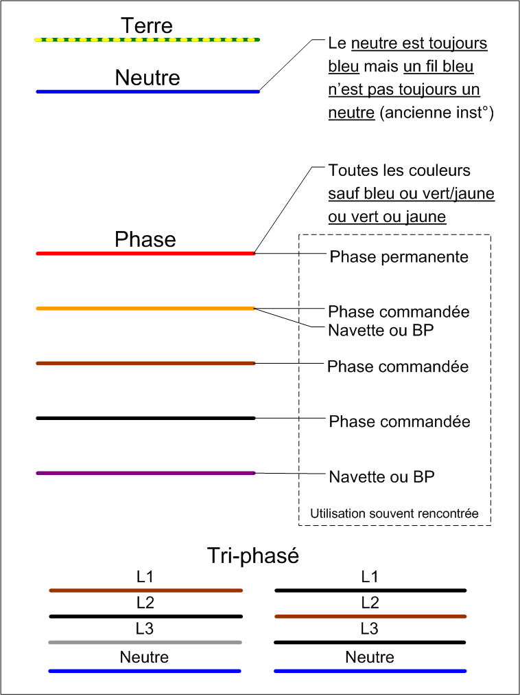
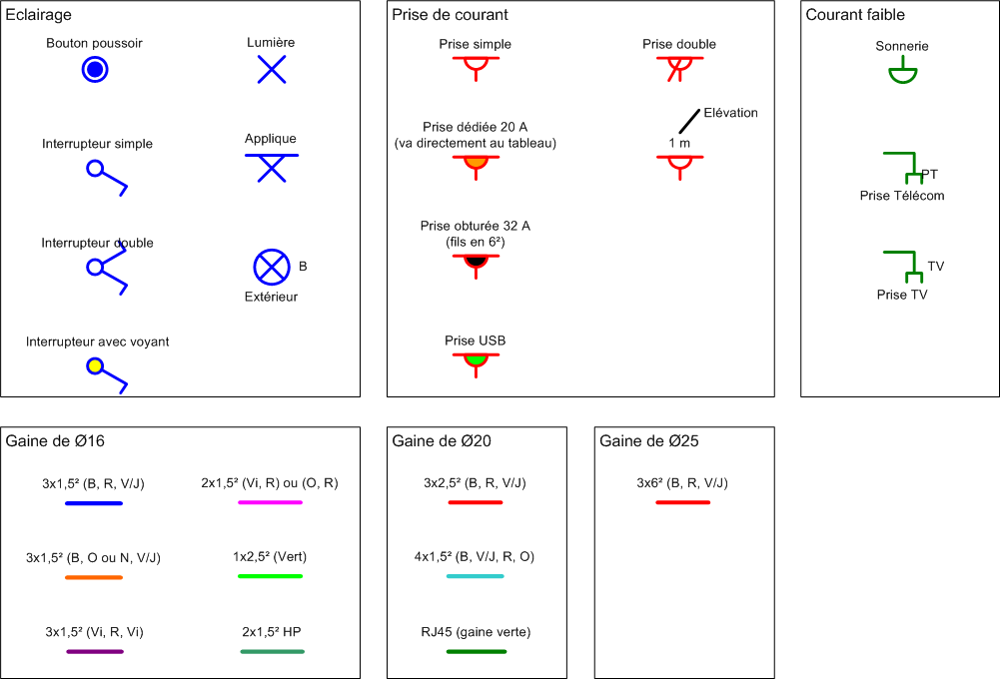

##############
Mise en oeuvre
##############

.. contents:: Menu
   :local:
   :depth: 1
   :backlinks: entry

GTL
===

.. image:: http://www.norme-electricite.com/tableau/images/disposition-GTL.jpg

Fils électriques
================

Sections
--------

+----------------------------+---------+-------------+-------------------------------+
|           Circuit          | Section | Disjoncteur |      Nombre d'équipement      |
+----------------------------+---------+-------------+-------------------------------+
|    Prise de courant 16 A   |   1,5²  |     16 A    |      5 prises par circuit     |
+                            +---------+-------------+-------------------------------+
|                            |   2,5²  |     20 A    |      8 prises par circuit     |
+----------------------------+---------+-------------+-------------------------------+
|     Prise spécialisée :    |   2,5²  |     20 A    |               1               |
|        LV, LL, SL,         |         |             |                               |
|      Four, Congélateur     |         |             |                               |
+----------------------------+---------+-------------+-------------------------------+
|          Eclairage         |   1,5²  |     16 A    |      8 points par circuit     |
+----------------------------+---------+-------------+-------------------------------+
| Prise de courant commandée |   1,5²  |     16 A    | 2 prises max par interrupteur |
+----------------------------+---------+-------------+-------------------------------+
|     Plaques de cuisson     |    6²   |     32 A    |               1               |
+----------------------------+---------+-------------+-------------------------------+
|             VMC            |   1,5²  |     2 A     |               1               |
+----------------------------+---------+-------------+-------------------------------+

Couleurs
--------

Légende
=======

